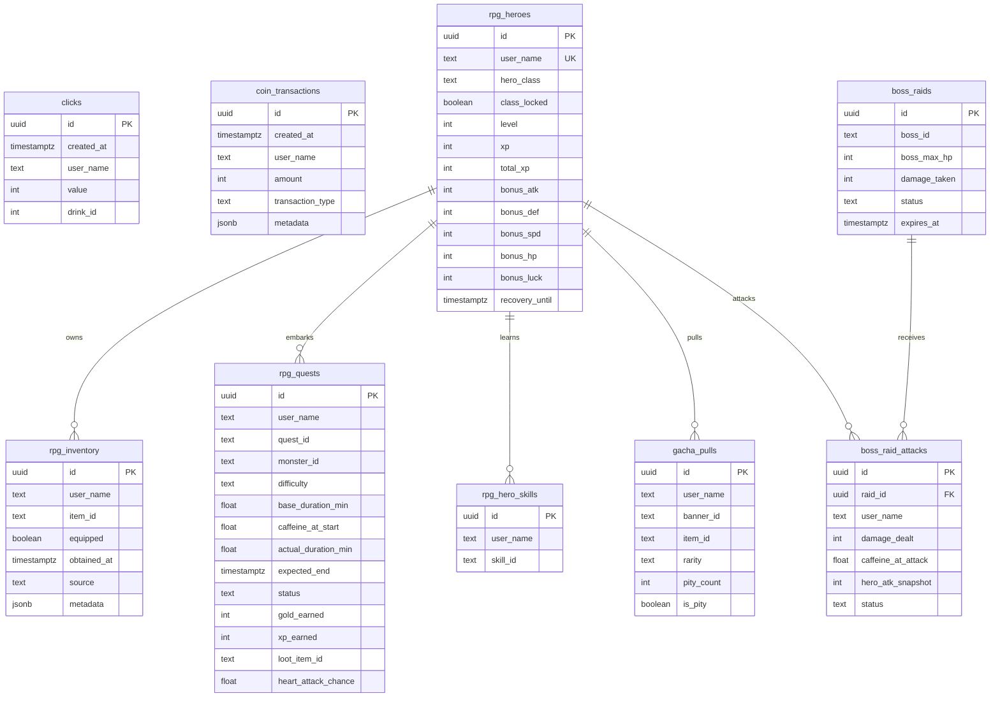

# Data Model Extensions — Full Schema Reference

> **Database**: Supabase (PostgreSQL). All timestamps stored as `TIMESTAMPTZ` (UTC).
> **Key design principle**: Minimize new tables. Leverage `coin_transactions.metadata` JSONB for lightweight state where possible. New tables only for entities with high write frequency or complex relationships.

---

## 1. Supabase Dashboard Instructions (Step-by-Step)

If a table needs to be created, do it via the Supabase Dashboard SQL Editor:
1. Open your Supabase project dashboard.
2. Go to the "SQL Editor" tab on the left sidebar.
3. Click "New Query".
4. Copy-paste the SQL from the sections below.
5. Click "Run" (or press CMD/CTRL + Enter).
6. Verify table creation in the "Table Editor" tab.

---

## 2. Modified Existing Tables

We rely heavily on the existing `coin_transactions` table by using the `metadata` JSONB field.

### EXACT `transaction_type` Metadata Examples

| `transaction_type` | Drop | Purpose | Example `metadata` |
|---|---|---|---|
| `"drink_log"` | 1 | Beverage log with travel location | `{"drink": "coffee", "temperature": "hot", "drink_id": 1, "country": "ES"}` |
| `"preference"` | 1 | Default country (home base) | `{"default_country": "ES"}` |
| `"rpg_class_select"` | 2 | One-time initial class choice | `{"hero_class": "warrior", "initial": true}` |
| `"rpg_reclass"` | 2 | Class change via Reclass Scroll | `{"old_class": "warrior", "new_class": "mage", "item_consumed": "scroll_of_reclass"}` |
| `"rpg_sell"` | 2 | Item sold for gold | `{"item_id": "iron_sword_lv1", "gold": 15}` |
| `"rpg_equip"` | 2 | Item equipped/unequipped | `{"item_id": "iron_sword_lv3", "action": "equip", "slot": "weapon"}` |
| `"gacha_purchase"` | 3 | Coins spent on gacha pulls | `{"banner_id": "forge_ancients", "pull_count": 10, "cost": 450}` |
| `"wrapped"` | 4 | Wrapped view tracking | `{"viewed": true, "year": 2026, "personality": "midnight_alchemist"}` |

---

## 3. ALL SQL CREATE TABLE Statements (Copy-Pasteable)

### Drop 2 Tables

```sql
-- RPG Heroes Table
CREATE TABLE rpg_heroes (
    id              UUID DEFAULT gen_random_uuid() PRIMARY KEY,
    user_name       TEXT NOT NULL UNIQUE,
    hero_class      TEXT NOT NULL,  -- 'warrior', 'mage', 'rogue', 'ranger'
    class_locked    BOOLEAN NOT NULL DEFAULT true,
    level           INTEGER NOT NULL DEFAULT 1,
    xp              INTEGER NOT NULL DEFAULT 0,
    total_xp        INTEGER NOT NULL DEFAULT 0,
    bonus_atk       INTEGER NOT NULL DEFAULT 0,
    bonus_def       INTEGER NOT NULL DEFAULT 0,
    bonus_spd       INTEGER NOT NULL DEFAULT 0,
    bonus_hp        INTEGER NOT NULL DEFAULT 0,
    bonus_luck      INTEGER NOT NULL DEFAULT 0,
    recovery_until  TIMESTAMPTZ,  -- NULL = not recovering
    created_at      TIMESTAMPTZ DEFAULT now()
);

CREATE UNIQUE INDEX idx_rpg_heroes_user ON rpg_heroes(user_name);


-- RPG Inventory Table
CREATE TABLE rpg_inventory (
    id          UUID DEFAULT gen_random_uuid() PRIMARY KEY,
    user_name   TEXT NOT NULL,
    item_id     TEXT NOT NULL,          -- e.g. 'iron_sword_lv3'
    equipped    BOOLEAN NOT NULL DEFAULT false,
    obtained_at TIMESTAMPTZ DEFAULT now(),
    source      TEXT NOT NULL,          -- 'quest_loot', 'gacha', 'raid_loot', 'shop'
    metadata    JSONB DEFAULT '{}'
);

CREATE INDEX idx_rpg_inv_user ON rpg_inventory(user_name);
CREATE INDEX idx_rpg_inv_equipped ON rpg_inventory(user_name) WHERE equipped = true;


-- RPG Quests Table
CREATE TABLE rpg_quests (
    id                  UUID DEFAULT gen_random_uuid() PRIMARY KEY,
    user_name           TEXT NOT NULL,
    quest_id            TEXT NOT NULL,
    monster_id          TEXT NOT NULL,
    difficulty          TEXT NOT NULL,           -- 'easy', 'medium', 'hard', 'legendary'
    started_at          TIMESTAMPTZ NOT NULL DEFAULT now(),
    base_duration_min   FLOAT NOT NULL,
    caffeine_at_start   FLOAT NOT NULL DEFAULT 0,
    actual_duration_min FLOAT NOT NULL,
    expected_end        TIMESTAMPTZ NOT NULL,
    status              TEXT NOT NULL DEFAULT 'active', -- 'active', 'completed', 'failed_heart_attack', 'abandoned'
    gold_earned         INTEGER DEFAULT 0,
    xp_earned           INTEGER DEFAULT 0,
    loot_item_id        TEXT,                    -- NULL if no drop
    heart_attack_chance FLOAT DEFAULT 0,
    completed_at        TIMESTAMPTZ
);

CREATE INDEX idx_quests_user ON rpg_quests(user_name);
CREATE INDEX idx_quests_active ON rpg_quests(user_name, status) WHERE status = 'active';
```

### Drop 3 Tables

```sql
-- RPG Hero Skills Table
CREATE TABLE rpg_hero_skills (
    id          UUID DEFAULT gen_random_uuid() PRIMARY KEY,
    user_name   TEXT NOT NULL,
    skill_id    TEXT NOT NULL,
    unlocked_at TIMESTAMPTZ DEFAULT now(),
    CONSTRAINT unique_user_skill UNIQUE (user_name, skill_id)
);

CREATE INDEX idx_skills_user ON rpg_hero_skills(user_name);


-- Gacha Pulls Table
CREATE TABLE gacha_pulls (
    id          UUID DEFAULT gen_random_uuid() PRIMARY KEY,
    user_name   TEXT NOT NULL,
    banner_id   TEXT NOT NULL,
    item_id     TEXT NOT NULL,
    rarity      TEXT NOT NULL,       -- 'common', 'uncommon', 'rare', 'epic', 'legendary'
    pity_count  INTEGER NOT NULL,
    is_pity     BOOLEAN NOT NULL DEFAULT false,
    created_at  TIMESTAMPTZ DEFAULT now()
);

CREATE INDEX idx_gacha_user ON gacha_pulls(user_name);
CREATE INDEX idx_gacha_banner ON gacha_pulls(user_name, banner_id);


-- Boss Raids Table
CREATE TABLE boss_raids (
    id              UUID DEFAULT gen_random_uuid() PRIMARY KEY,
    boss_id         TEXT NOT NULL,
    boss_max_hp     INTEGER NOT NULL,
    damage_taken    INTEGER NOT NULL DEFAULT 0,
    started_at      TIMESTAMPTZ NOT NULL DEFAULT now(),
    expires_at      TIMESTAMPTZ NOT NULL,    -- started_at + 48h
    status          TEXT NOT NULL DEFAULT 'active',  -- 'active', 'defeated', 'expired'
    defeated_at     TIMESTAMPTZ
);

CREATE INDEX idx_raids_active ON boss_raids(status) WHERE status = 'active';


-- Boss Raid Attacks Table
CREATE TABLE boss_raid_attacks (
    id                  UUID DEFAULT gen_random_uuid() PRIMARY KEY,
    raid_id             UUID NOT NULL REFERENCES boss_raids(id),
    user_name           TEXT NOT NULL,
    damage_dealt        INTEGER DEFAULT 0,
    caffeine_at_attack  FLOAT NOT NULL DEFAULT 0,
    hero_atk_snapshot   INTEGER NOT NULL,
    started_at          TIMESTAMPTZ NOT NULL DEFAULT now(),
    duration_min        FLOAT NOT NULL,
    expected_end        TIMESTAMPTZ NOT NULL,
    status              TEXT NOT NULL DEFAULT 'active',
    completed_at        TIMESTAMPTZ
);

CREATE INDEX idx_raid_atk_raid ON boss_raid_attacks(raid_id);
CREATE INDEX idx_raid_atk_user ON boss_raid_attacks(user_name);
CREATE INDEX idx_raid_atk_active ON boss_raid_attacks(user_name, status) WHERE status = 'active';
```

---

## 4. Entity Relationship Diagram (ERD)



---

## 5. Key Queries Reference

### A. Enforce Single Active Quest (No multi-questing)
```sql
SELECT * FROM rpg_quests 
WHERE user_name = $1 AND status = 'active' 
LIMIT 1;
```

### B. Get User's Equipped Items
```sql
SELECT item_id, obtained_at, source 
FROM rpg_inventory 
WHERE user_name = $1 AND equipped = true;
```

### C. Gacha Pity Counter (Drop 3)
```sql
SELECT COUNT(*) as pulls_since_legendary
FROM gacha_pulls 
WHERE user_name = $1 AND banner_id = $2
AND created_at > COALESCE(
    (SELECT MAX(created_at) FROM gacha_pulls 
     WHERE user_name = $1 AND banner_id = $2 AND rarity = 'legendary'),
    '1970-01-01'::timestamptz
);
```

### D. Travel Passport (Drop 1)
```sql
SELECT DISTINCT metadata->>'country' as country
FROM coin_transactions
WHERE user_name = $1 
AND transaction_type = 'drink_log' 
AND metadata->>'country' IS NOT NULL;
```

### E. Boss Raid Damage per User (Drop 3)
```sql
SELECT user_name, SUM(damage_dealt) as total_dmg, COUNT(*) as attacks
FROM boss_raid_attacks 
WHERE raid_id = $1 AND status = 'completed'
GROUP BY user_name 
ORDER BY total_dmg DESC;
```

### F. Wrapped 2026 Date Scope Filter (Drop 4)
```sql
-- All queries for Wrapped MUST include this date filter:
WHERE created_at >= '2026-01-01T00:00:00+00:00'
  AND created_at < '2026-11-01T00:00:00+00:00'
```
